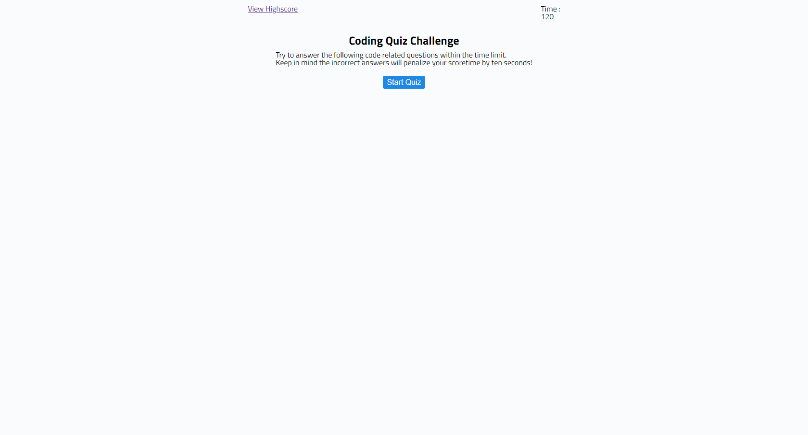

# 04 Web APIs: Code Quiz

- This assignment was done to learn web apis.
- This project is a timed code quiz.
- The total time of quiz is 120 seconds.
- There are total nine questions. The next question is displayed only when user clicks on correct answer.
- The user can also save their score when the quiz ends. The score is saved in local storage.
- The user can see their saved scored when clicking on 'View Highscore'. The highest score is displayed first.
- The user also has the option to clear their score history.

## Mockup

## Technology used

HTML, CSS, JavaScript

## Link to deployed application

https://sona29.github.io/codequiz/index.html
